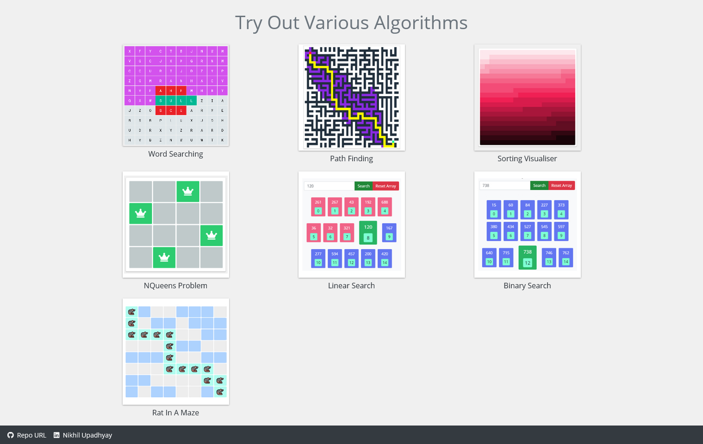
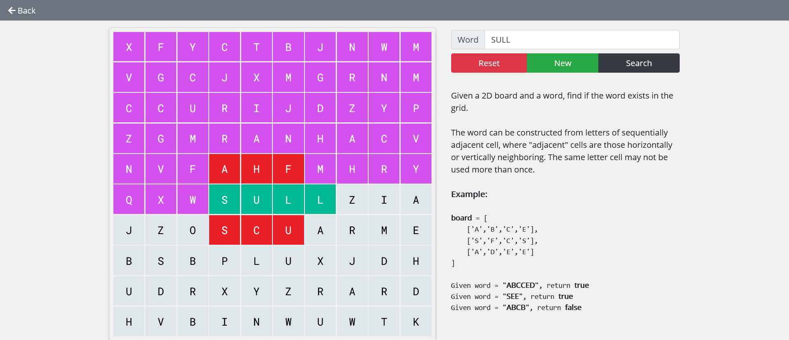
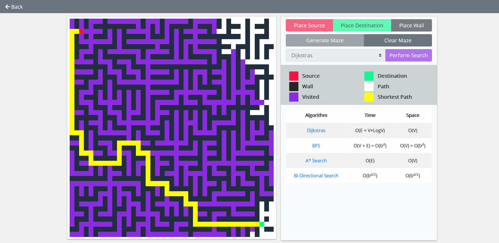
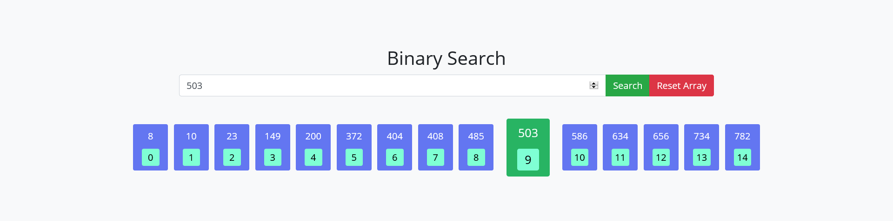

# Algorithms Visualizer

I want to learn these famous algorithms and I know React JS so let's try to mix these so that I can make algorithms use in the development.

# Screenshots

## Visualization of famous algos

## Word Search using DFS

## Path Finder Algorithms

## Binary Search

# How to run this project ?

- You should have NodeJS insalled in your localhost machine [Download NodeJS](https://nodejs.org/en/)
- Open Terminal
- Navigate to Project Directory
- Enter the following command `npm install` this will install all required dependencies
- After the previous command is executed, Enter the following command `npm start`
- Wait for it to compile
- Open [http://localhost:3000](http://localhost:3000) to view it in the browser.
- Enjoy the visualiser

This project was bootstrapped with [Create React App](https://github.com/facebook/create-react-app).

# Resources

- [Clement's Video on Path Finding - Youtube](https://www.youtube.com/watch?v=msttfIHHkak)

How to implement these algos in javascript so, courses at frontend masters (PS - Frontend masters is a great platform to explore more about frontend engineering by industry experts, you can access it 6 months free by Github Education Pack) helped me a lot which stated given below -

- [Course - 1 by Brian Holt](https://frontendmasters.com/courses/computer-science/)
- [Course - 2 by Brian Holt](https://frontendmasters.com/courses/computer-science-2/)
